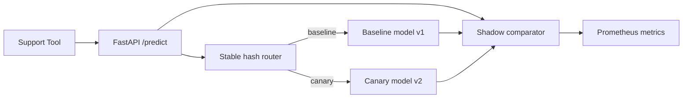

# Model Serving Canary Platform

`model-serving-canary-platform` is a production-shaped FastAPI service that demonstrates how to release a new model safely with deterministic canary routing, shadow evaluation, Prometheus metrics, and deployment-ready infrastructure assets.

## What it demonstrates

- Deterministic canary rollout decisions based on a stable hash of `ticket_id`
- Side-by-side baseline and canary prediction comparison for rollout review
- Prometheus metrics for selected model traffic, latency, and shadow mismatches
- Docker, Kubernetes, and Terraform assets that make the repo recruiter-readable

## Architecture



## Project layout

```text
app/                         FastAPI entrypoint, config, metrics, service layer
src/model_serving_canary_platform/  rollout and inference domain logic
tests/                       API and routing tests
infra/docker/                Container image
infra/k8s/                   Kubernetes manifests
infra/terraform/             Terraform deployment skeleton
docs/CASE_STUDY.md           Portfolio narrative
```

## Quickstart

```bash
python3 -m venv .venv
. .venv/bin/activate
pip install -e .[dev]
pytest
uvicorn app.main:app --reload
```

Health check:

```bash
curl http://127.0.0.1:8000/health
```

Prediction example:

```bash
curl -X POST http://127.0.0.1:8000/predict \
  -H "Content-Type: application/json" \
  -d '{
    "ticket_id": "INC-10091",
    "account_tier": "enterprise",
    "minutes_open": 215,
    "message_length": 890,
    "sentiment_score": -0.51,
    "similar_incidents": 5,
    "escalation_keywords": 3,
    "canary_percent": 50
  }'
```

Metrics endpoint:

```bash
curl http://127.0.0.1:8000/metrics
```

## Docker

```bash
docker compose up --build
```

## Testing

```bash
pytest
python scripts/smoke_predict.py
```

## Kubernetes and Terraform

- Kubernetes manifests are in `infra/k8s/`.
- Terraform mirrors the deployment shape in `infra/terraform/`.
- Both assume an external cluster and published container image.

## Observability and security notes

- `/metrics` exposes Prometheus-compatible counters and latency histograms.
- Stable hash routing avoids per-request randomness during rollout validation.
- The repo uses environment-based configuration and does not include secrets.

## Limitations

- The models are deterministic heuristics, not trained artifacts.
- Progressive delivery is implemented in-app rather than through a service mesh.
- Terraform is a deployment skeleton and was not applied to a live cluster in this run.
